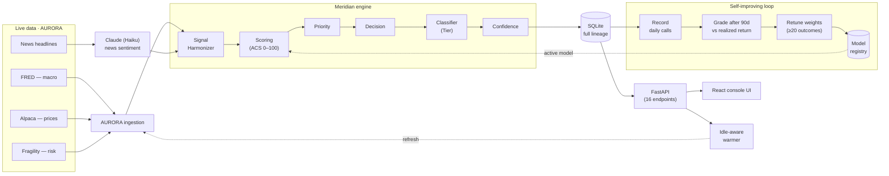

# MERIDIAN

**Financial intelligence & decision engine** — scores, ranks, and stress-tests a
watchlist of equities from live market data, builds a suggested portfolio, and
grades and retunes its own model over time.

**Status:** Live in production — https://meridian-finance.up.railway.app
**Type:** Private research / screening tool. **Not financial advice.**

Meridian does not execute and does not predict prices. It evaluates probability,
structure, and positioning — then converts that into ranked assets, weighted
allocations, and auditable reasoning that improves over time. Every output
carries a confidence level and traces back to its exact signal inputs.

---

## The score

Every tracked name gets an **Aurum Composite Score (ACS)**, shown in the UI as a
plain **Score (0–100)** — a weighted blend of four independent signals:

```
ACS = (Macro × 0.35) + (Price Trend × 0.30) + (News × 0.20) − (Risk × 0.15)
```

| Ingredient (UI)  | Engine | Weight | Measures                              | Source                 |
|------------------|--------|--------|---------------------------------------|------------------------|
| Macro            | MAS    |  0.35  | Market regime — rates, inflation, vol | FRED (via AURORA)      |
| Price Trend      | TAS    |  0.30  | The stock's own momentum / trend      | Alpaca prices          |
| News             | SAS    |  0.20  | Headline sentiment, scored by an LLM  | Claude (Haiku) on news |
| Risk             | SRS    | −0.15  | Structural fragility (penalty)        | Fragility model        |

**Tiers** (UI) / classifications (engine), plus the suggested **Signal**:

| Tier   | Classification  | Criteria                       | Signal                |
|--------|-----------------|--------------------------------|-----------------------|
| Tier 1 | CORE            | Score ≥ 75                     | Buy (ESCALATE)        |
| Tier 2 | HIGH-ASYMMETRY  | Score ≥ 55                     | Watch / Buy           |
| Tier 3 | TACTICAL        | Score ≥ 40                     | Watch (MONITOR)       |
| Avoid  | AVOID           | Score < 40, or a RESTRICT flag | Avoid (RESTRICT)      |

A **Confidence** level (High/Medium/Low) reflects how much the four signals agree.

---

## Architecture



**Engine (Python 3.12).** A stateless-per-run pipeline; every run gets a `run_id`
and is fully audit-logged:

```
SignalHarmonizer → ScoringEngine → PriorityEngine → DecisionLogic
    → Classifier → ConfidenceEngine → Traceability
```

**API + Frontend.** A thin FastAPI layer (16 endpoints) wraps the *same* engine
the CLI uses, and also serves the built React UI same-origin (so the SPA's
relative `/api` calls are domain-agnostic). Frontend is React 18 + Vite +
Tailwind + Recharts in a green/blue/black console theme.

**Data.** SQLite with full lineage — harmonized `signals`, `acs_scores`,
`decision_outcomes`, `model_registry`, `alerts`, `audit_log`, sessions.

**Live data via AURORA** (sibling "Bloomberg" backend on Railway): macro (FRED),
prices (Alpaca), news, and fragility — with a manual JSON fallback if it's down.

### Self-improving loop
1. **Records** every day's calls into `decision_outcomes` (one row per ticker/day).
2. **Grades** them after a 90-day window against the ticker's *realized* return.
3. **Retunes** the four weights once ≥ 20 outcomes are graded (versioned in the
   model registry).
4. **Alerts** on risk spikes, top-tier breaches, and low-confidence calls.

A background warmer keeps data fresh and caches hot; it's **idle-aware** (stops
re-billing the LLM after ~30 min of no traffic).

---

## Web app

| Page            | What it does                                                       |
|-----------------|-------------------------------------------------------------------|
| Console         | Terminal with 40+ commands (`scan`, `top 5`, `sector tech`, …)    |
| Recommendations | The ranked book — Score · Tier · Confidence · Signal             |
| Asset detail    | Full breakdown, "what drives the score", rationale, compare      |
| Portfolio       | Four-sleeve mix, sticky donut, diversification warnings           |
| Scenarios       | 50 macro "what ifs" — who holds up vs. gets hit                  |
| Status          | Scoring weights, track record by tier, active alerts             |
| How To Use      | Plain-English glossary of every term                             |

Portfolio sleeves: **Foundation** (core) · **Growth** · **Protection**
(defensive) · **Short-term** (tactical).

---

## CLI

```
python main.py scan <TICKER>         Score & classify one asset
python main.py recommend             Top-ranked names
python main.py build portfolio       Construct the four-sleeve allocation
python main.py compare <A> vs <B>    Side-by-side score breakdown
python main.py scenario <name>       Run a stress scenario
python main.py brief                 Daily intelligence brief
python main.py resolve <T> <ret>     Record a realized outcome
python main.py learn                 Run a meta-learning weight cycle
python main.py status / alerts       System status / active alerts
```

---

## Setup

Requires **Python 3.10+** (developed on 3.12).

```bash
python -m venv .venv && source .venv/bin/activate
pip install -r requirements.txt
cp .env.example .env          # add ANTHROPIC_API_KEY, AURORA_BASE_URL, etc.
python main.py recommend      # CLI

# Web app (two terminals)
python -m api                 # API on :8800
cd frontend && npm install && npm run dev   # UI on :5173 (proxies /api)
```

Key env vars: `ANTHROPIC_API_KEY`, `AURORA_ENABLED`, `AURORA_BASE_URL`,
`SENTIMENT_MODEL`, `UNIVERSE_SCAN_LIMIT`, `DB_PATH`.

---

## Deployment

Single **Docker** service on **Railway** (multi-stage: Node builds the UI,
Python serves API + UI), with a **persistent volume** for the DB and
**auto-deploy from GitHub** (`git push` to `main` → rebuild + ship). See
[`deploy/RAILWAY.md`](deploy/RAILWAY.md). A `launchd` agent takes **daily off-site
DB backups** ([`deploy/backup-railway-db.sh`](deploy/backup-railway-db.sh)).

```bash
docker build -t meridian . && docker run -e PORT=8080 -p 8080:8080 meridian
```

---

## Project structure

```
meridian/
├── core/            # pipeline, ACS engine, priority/decision logic, traceability
├── classification/  # asset universe, Tier classifier, confidence engine
├── portfolio/       # four-sleeve constructor + constraints
├── sandbox/         # 50 macro scenarios + simulator
├── modules/         # quant_assistant, sentiment_feed, research_copilot, fraud_aml
├── meta_learning/   # performance tracker (record/grade), weight adjuster
├── governance/      # audit log, model registry, compliance
├── outputs/         # alert system, daily brief, weekly summary
├── integrations/    # AURORA client/adapter/ingestion, Syntrackr overlay
├── interface/       # Rich CLI rendering + natural-language fallback
├── api/             # FastAPI app, serializers, static-SPA serving
├── frontend/        # React + Vite + Tailwind console UI
├── deploy/          # Dockerfile, Railway config, launchd agents, backups
├── db/              # schema.sql (+ runtime SQLite)
├── config/          # settings
└── tests/           # 65 tests
```

---

## Principles

- No autonomous execution; no real-time trading. All outputs are generated explicitly.
- Every output carries a confidence level and full rationale.
- Every decision traces to its exact signal inputs.

## Related systems

| System   | Role                                                           |
|----------|----------------------------------------------------------------|
| AURORA   | Data spine — normalized live signals (macro, price, news, risk)|
| Syntrackr| Tax-loss-harvesting overlay (optional, off by default)         |
